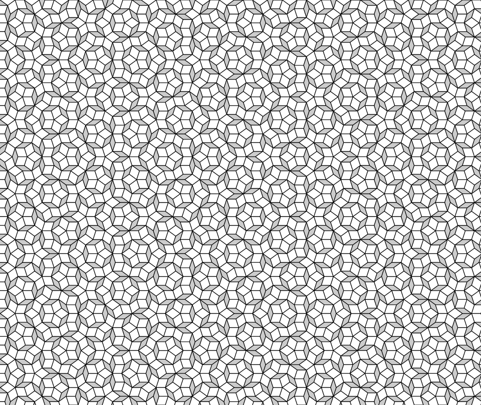
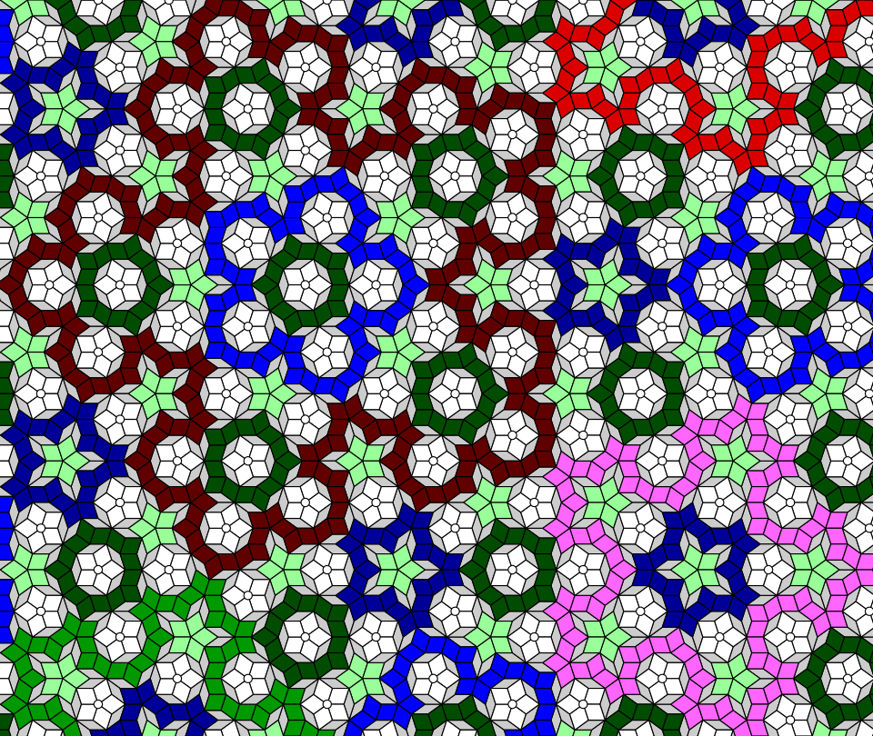

# Penrose Tilings: Introduction #

## Contents ##

Documentation pages:&nbsp; 
&bull;&nbsp;**Introduction**;&nbsp; 
&bull;&nbsp;[Paths](paths.md);&nbsp; 
&bull;&nbsp;[C&nbsp;code](c.md);&nbsp; 
&bull;&nbsp;[JSON&nbsp;output](json.md);&nbsp; 
&bull;&nbsp;[TSV&nbsp;output&nbsp;and&nbsp;a&nbsp;spreadsheet](tsv.md);&nbsp; 
&bull;&nbsp;[SVG&nbsp;output](svg.md);&nbsp; 
&bull;&nbsp;[PostScript&nbsp;output&nbsp;(distillable)](postscript_distillable.md);&nbsp; 
&bull;&nbsp;[PostScript&nbsp;output&nbsp;(data)](postscript_data.md);&nbsp; 
&bull;&nbsp;[Physical&nbsp;tiling](physical_tiling.md).

## Introduction ##

A Penrose tiling is a beautiful thing, of which [the&nbsp;author](https://jdawiseman.com/author.html) is very fond. 
It is an aperiodic tiling, made from two rhombi with tight corners of 72&deg; and 36&deg;. 
Behold!

Observe the &lsquo;fat&rsquo; white rhombi, with corners of 72&deg; and 108&deg;; 
observe the &lsquo;thin&rsquo; grey rhombi, with corners of 36&deg; and 144&deg;. 

This works really well on the scale of a kitchen ([e.g.](../images/20230923_kitchen_tiles.png)). 
But there is a property that might be unwanted on the scale of hectares. 
That is, local texture is quite uniform.

In the limit there are &frac12;(1&nbsp;+&nbsp;&radic;5) &asymp;&nbsp;1.618 times as many fats as thins, each of which has an area bigger by the same ratio, 
so the fats become (5&nbsp;+&nbsp;&radic;5)/10 &asymp;&nbsp;72.36% of the area, 
and the thins are (5&nbsp;&minus;&nbsp;&radic;5)/10 &asymp; 27.639% of the area. 
This is true in the limit, but is approximately true even for small areas. 
I.e., the local texture is quite uniform.

But wait! 
Each fat tile has two fat neighbours. 
So fat tiles form paths. 
Paths that don&rsquo;t reach the edge are closed, and there are such paths only of particular lengths: 
5, 5 (two types of 5-path), 15, 25, 55, 105, 215, 425, 855, 1705, 3415, 6825, &hellip;.

Let&rsquo;s colour paths by length.

The &lsquo;round&rsquo; paths of length 5 are white, also marked with a small interior circle. 
The &lsquo;pointy&rsquo; paths of length 5 are pale green (&lsquo;round&rsquo; versus &lsquo;pointy&rsquo; visible by inspecting the touching thins).
Paths of length 15 are dark green; 25s are dark blue; 55s are bright blue; the 105 is pink; 215 is brown/maroon; 425 is dull green; the red is a long open path.

And the optical uniformity has disappeared: at all scales there is structure, interesting and playful and curious structure.

Long paths are, in a sense that is precisely definable, &asymp;&#8239;1.44 dimensional. 
This number is, in effect, a measure of their wiggliness. 
It is an aesthetically pleasing dimension: definitely bigger than boring 1; definitely smaller than conventional 2; puzzlingly between.

## The Hope ##

The hope is to persuade the mayor of a suitable city to make a giant Penrose tiling, with coloured paths, covering at least a&nbsp;hectare &asymp;&nbsp;2&frac12;&nbsp;acres. 

If the tiles&rsquo; edge length were 50cm, this project would require most of 50k tiles. 
Hence this would not be a trivial project.

But such a thing would be fabulous to behold. 
Tourists, not all of them mathematicians, would come from near and far to see, to walk around and over, and to sit nearby having &mdash; like Sir Roger himself &mdash; [soup and wine](https://www.theguardian.com/science/2020/oct/11/roger-penrose-black-holes-big-bangs-and-a-universe-that-recycles-itself).

The relevant digital work for that is done by the software in this repo.

## Software ##

Much of the work is done in [C](https://en.wikipedia.org/wiki/C_(programming_language)). 
The C:
* Starts with a trivial tiling; 
* Recursively generates larger tilings, by
    * replacing each fat with by five smaller tiles, and each thin tile by four smaller tiles,
    * removing duplicates,
    * filling holes, and neatening edges where it is known what a tile must be;
* Identifies tiles&rsquo; neighbours;
* Finds the paths, and various statistics of them;
* Identifies, for both closed paths and for thin rhombi, the smallest enclosing path and related information;
* Exports much data in multiple formats:
    * [JSON](https://en.wikipedia.org/wiki/JSON), for subsequent machine manipulation,
    * [TSV](https://en.wikipedia.org/wiki/Tab-separated_values),
    * [SVG](https://en.wikipedia.org/wiki/SVG) of rhombi, for display in a browser and in this documentation, 
    * SVG of arcs within the rhombi, for display in a browser, 
    * [PostScript](https://en.wikipedia.org/wiki/PostScript), painting rhombi, for conversion to [PDF](https://en.wikipedia.org/wiki/PDF),
    * PostScript, painting arcs, for conversion to PDF,
    * PostScript as data, for use by a PostScript program.
* The TSV is for importation into a spreadsheet. There is an example spreadsheet, with VBA for chart control and for creation of range names; the plottable series being dynamic arrays.
* Two of the three PostScript formats are themselves a mix of code and data, these two being user-changeable.
* The SVG output is also sufficiently reader-friendly to be user-changeable.

Hence there is much code, and much useful output.

Indeed, for small tilings (a room rather than hectares), the output in this repo, with the large files hosted elsewhere, might well suffice.
I.e., you might well not need the C at all.

## Shape and colour ##

The [author](https://jdawiseman.com/author.html) has a very strong sense of shape, especially of geometrical shape. 
Indeed, this might be why I am so fond the Penrose tiling.

But my sense of colour is much much weaker. 
Indeed, I generally consider design in black-and-white, with colour being added an afterthought.

Hence end users are strongly encouraged not to be shy about reaching into the output to change colours. 
The two [distillable PostScript outputs](postscript_distillable.md), and the [two types of SVG](svg.md), are deliberately friendly to those making changes. 
E.g., in the PostScript search for &ldquo;[<code>setrgbcolor</code>](https://www.adobe.com/jp/print/postscript/pdfs/PLRM.pdf#page=695)&rdquo;, and change. 
E.g., in the SVG, search for &ldquo;[<code>fill=</code>](https://www.w3schools.com/graphics/svg_fill.asp)&rdquo;, and change.

## Links ##

See other pages in this documentation:&nbsp; 
&bull;&nbsp;[Paths](paths.md);&nbsp; 
&bull;&nbsp;[C&nbsp;code](c.md);&nbsp; 
&bull;&nbsp;[JSON&nbsp;output](json.md);&nbsp; 
&bull;&nbsp;[TSV&nbsp;output&nbsp;and&nbsp;a&nbsp;spreadsheet](tsv.md);&nbsp; 
&bull;&nbsp;[SVG&nbsp;output](svg.md);&nbsp; 
&bull;&nbsp;[PostScript&nbsp;output&nbsp;(distillable)](postscript_distillable.md);&nbsp; 
&bull;&nbsp;[PostScript&nbsp;output&nbsp;(data)](postscript_data.md)&nbsp; 
&bull;&nbsp;[Physical&nbsp;tiling](physical_tiling.md).
