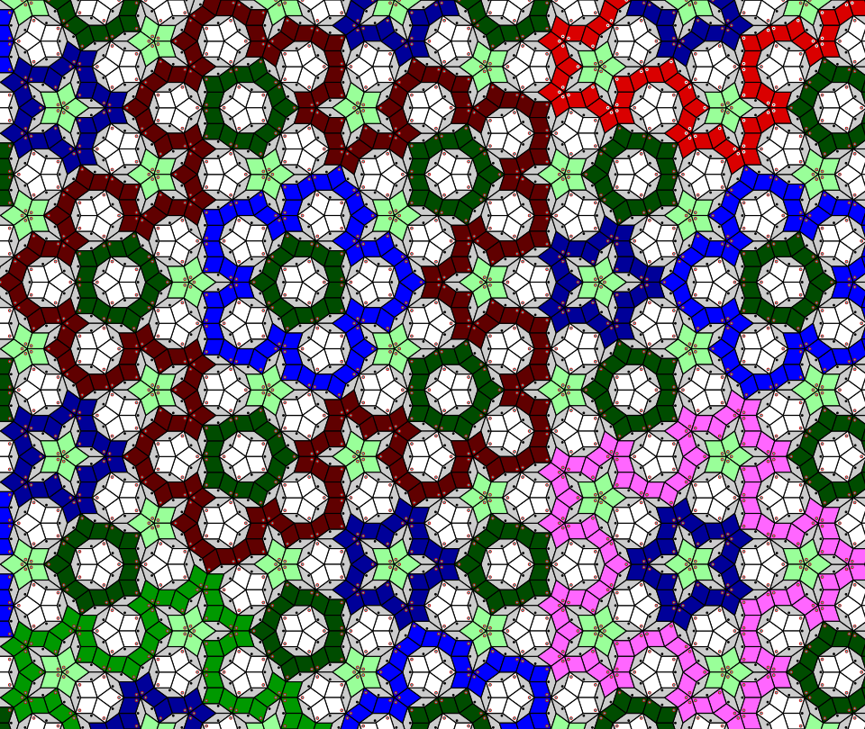

# Penrose Tilings: Paths #

## Contents ##

Documentation pages:&nbsp; 
&bull;&nbsp;[Introduction](introduction.md);&nbsp; 
&bull;&nbsp;**Paths**;&nbsp; 
&bull;&nbsp;[C&nbsp;code](c.md);&nbsp; 
&bull;&nbsp;[JSON&nbsp;output](json.md);&nbsp; 
&bull;&nbsp;[TSV&nbsp;output&nbsp;and&nbsp;a&nbsp;spreadsheet](tsv.md);&nbsp; 
&bull;&nbsp;[SVG&nbsp;output](svg.md);&nbsp; 
&bull;&nbsp;[PostScript&nbsp;output&nbsp;(distillable)](postscript_distillable.md);&nbsp; 
&bull;&nbsp;[PostScript&nbsp;output&nbsp;(data)](postscript_data.md);&nbsp; 
&bull;&nbsp;[Physical&nbsp;tiling](physical_tiling.md).

## Paths ##

My hope is that somewhere somebody makes a big Penrose tiling, in which paths are coloured by length. 
Paths are interesting to me, more interesting than tiles. 
This page describes observed properties of paths. 
Much of this observed data, in the table and elsewhere on this page, seems not to have been said elsewhere. 
But much of what is said is here is observation, rather than proof. 
So: if anything said here is wrong, please raise an issue explaining what&rsquo;s wrong. 
And: if anything said here has been said by others before, please raise an issue with links to sources.)

Each fat tiles has two fat neighbours. 
So fat tiles form paths, as is visible in the next image.

Tiles are orientated. 
That is, for each fat tile, one of its acute 72&deg; corners is &lsquo;north&rsquo;, with east-south-west clockwise from north. 
For the thins, one of the obtuse 144&deg; corners is &lsquo;north&rsquo;. 
This need not matter when laying tiles, but matters for the computation. 
In the following diagram, north corners have been marked with small circles.

(Note: these north-corner circles were added to the SVG by a small alteration, done by hand, taking only a few minutes, each marked with the comment &ldquo;<code>\<\!\-\- north-corner circle \-\-\></code>&rdquo;. 
Do search for and play with the three lines containing that &mdash; for thin tiles, fats in closed paths, and fats in open paths. 
The output really is user-changeable.)

Paths that don&rsquo;t reach the edge are closed, and there are such paths only of particular lengths: 
5, 5 (two types of 5-path), 15, 25, 55, 105, 215, 425, 855, 1705, 3415, 6825, &hellip;,&nbsp; 2&times;[_n_&minus;2]&nbsp;+&nbsp;[_n_&minus;1]&nbsp; =&nbsp;&nbsp;(2<small>*n*</small>&nbsp;&minus;&nbsp;(&minus;1)<small>*n*</small>)&times;5&frasl;3. 
All closed paths have rotational symmetry of order&nbsp;5, and have lines of reflection symmetry every 36&deg;.

Within a closed path of rank *n*&nbsp;&ge;&nbsp;3, the largest enclosed path is of rank *n*&nbsp;&minus;&nbsp;2, of which there is only one.
Inside the *n* are none of the *n*&nbsp;&minus;&nbsp;1; none of the *n*&nbsp;&minus;&nbsp;3; and, assuming *n*&nbsp;&ge;&nbsp;5, of the *n*&nbsp;&minus;&nbsp;4 there are six, being five directly inside and one inside the *n*&nbsp;&minus;&nbsp;2.

The next table contains much about such closed paths. 
In it:
* &phi; =&nbsp;the golden ratio =&nbsp;&frac12;(&radic;5&nbsp;+&nbsp;1) &asymp;&nbsp;1.618;
* &phi;<small>2</small>&nbsp; =&nbsp;&nbsp;&frac12;(&radic;5&nbsp;+&nbsp;3)&nbsp; =&nbsp;&nbsp;&phi;&nbsp;+&nbsp;1 &asymp;&nbsp;2.618;
* &phi;<small>&minus;1</small>&nbsp; =&nbsp;&nbsp;&frac12;(&radic;5&nbsp;&minus;&nbsp;1)&nbsp; =&nbsp;&nbsp;&phi;&nbsp;&minus;&nbsp;1 &asymp;&nbsp;0.618;
* &phi;<small>&minus;2</small>&nbsp; =&nbsp;&nbsp;&frac12;(3&nbsp;&minus;&nbsp;&radic;5)&nbsp; =&nbsp;&nbsp;2&nbsp;&minus;&nbsp;&phi; &asymp;&nbsp;0.381966.

| *n* |   Length | Num Interior Fats | Num Interior Thins | Outward direction | Radius Min &divide;Edge | Radius Max &divide;Edge |
|----:|---------:|--------:|--------:|------:|-------:|-------:|
|   1 |  Round 5 |       0 |       0 | North |   0.81 |   0.81 |
|   2 | Pointy 5 |       0 |       0 | South |   0.81 |   0.81 |
|   3 |       15 |       5 |       5 | North |   2.02 |   2.43 |
|   4 |       25 |       5 |      10 | South |   1.81 |   3.31 |
|   5 |       55 |      45 |      40 | North |   3.61 |   6.66 |
|   6 |      105 |      80 |      85 | South |   4.43 |  10.14 |
|   7 |      215 |     350 |     270 | North |   7.83 |  17.75 |
|   8 |      425 |     760 |     620 | South |  11.28 |  28.07 |
|   9 |      855 |   2,565 |   1,805 | North |  18.91 |  46.79 |
|  10 |    1,705 |   6,085 |   4,370 | South |  29.23 |  75.05 |
|  11 |    3,415 |  18,245 |  12,160 | North |  47.94 | 122.80 |
|  12 |    6,825 |  45,240 |  30,405 | South |  76.20 | 198.04 |
|  13 |   13,655 | 127,710 |  82,470 | North | 123.96 | 321.81 |
|  14 |   27,305 | 324,240 | 210,180 | South | 199.20 | 520.04 |
|  15 |   54,615 | 885,965 | 561,725 | North | 322.96 | 842.81 |
| Recursion | [*n*&minus;1] +2&nbsp;&times;&nbsp;[*n*&minus;2] &nbsp; &nbsp; &nbsp; &nbsp; | 2&nbsp;&times;&nbsp;[*n*&minus;1] +6&nbsp;&times;&nbsp;[*n*&minus;2] &minus;9&nbsp;&times;&nbsp;[*n*&minus;3] &minus;8&nbsp;&times;&nbsp;[*n*&minus;4] +4&nbsp;&times;&nbsp;[*n*&minus;5] +&nbsp;5 | [*n*&minus;1] +5&nbsp;&times;&nbsp;[*n*&minus;2] &minus;3&nbsp;&times;&nbsp;[*n*&minus;3] &nbsp; &nbsp; &nbsp; | +180&deg; | ? | ? |
| Formula | (2<small>*n*</small>&nbsp;&minus;&nbsp;(&minus;1)<small>*n*</small>)&nbsp;&times;&nbsp;5&frasl;3 | &phi;<small>2*n*</small>&nbsp;(7&radic;5&nbsp;&minus;&nbsp;5)/22 &minus;&nbsp;&phi;<small>&minus;2*n*</small>&nbsp;(7&radic;5&nbsp;+&nbsp;5)/22 &minus;&nbsp;(&minus;2)<small>*n*</small>&nbsp;&times;&nbsp;25&frasl;66 +&nbsp;5&frasl;6 &minus;&nbsp;2<small>*n*</small>&nbsp;&times;&nbsp;5&frasl;6 +&nbsp;(&minus;1)<small>*n*</small>&nbsp;&times;&nbsp;5&frasl;6 | &phi;<small>2*n*</small>&nbsp;(10&ThinSpace;&minus;&ThinSpace;3&radic;5)/11 +&nbsp;&phi;<small>&minus;2*n*</small>&nbsp;(10&ThinSpace;+&ThinSpace;3&radic;5)/11 &minus;&nbsp;(&minus;2)<small>*n*</small>&nbsp;&times;&nbsp;5&frasl;33 &minus;&nbsp;5&frasl;3 &nbsp; &nbsp; | Odd&DoubleLongRightArrow;N Even&DoubleLongRightArrow;S | ? | ? |
| Limit&nbsp;&#8784; | 2<small>*n*</small>&nbsp;&times;&nbsp;5&frasl;3 &#8784;&ThinSpace;3.97&times; &ThinSpace;(&radic;*thin*)<small>ln(2)/ln(&phi;)</small> &asymp;&nbsp;2.81&ThinSpace;&times; (&radic;*fat*)<small>ln(2)/ln(&phi;)</small> | *fat*&nbsp;= &phi;<small>2*n*</small>&nbsp;(7&radic;5&nbsp;&minus;&nbsp;5)/22 | *thin*&ThinSpace;= &phi;<small>2*n*</small>&nbsp;(10&nbsp;&minus;&nbsp;3&radic;5)/11 | &NotExists; | &phi;<small>*n*&minus;3</small> | &phi;<small>*n*&minus;1</small> |

Observe that the length of a long path varies as the square root of its area (which is a linear measure) to the power of ln(2)&#8239;/&#8239;ln(&phi;)&nbsp;&asymp;&nbsp;1.44042. 
That is, long paths are approximately 1.44 dimensional. 
(Trivially ln(2)&#8239;/&#8239;ln(&phi;)&nbsp;&NotElement;&nbsp;&Qopf;, but I don&rsquo;t know whether [algebraic](http://en.wikipedia.org/wiki/Algebraic_number).) 

The observed data is consistent with, in a suffiently large tiling, the number of closed paths of each length being [geometrically distributed](http://en.wikipedia.org/wiki/Geometric_distribution), with decay 
&frac12;(3&nbsp;&minus;&nbsp;&radic;5) &asymp;&nbsp;0.381966. 
If this is precisely true, then the average of the lengths of paths tends to 5&nbsp;+&nbsp;2&radic;5 &asymp;&nbsp;9.472. 
If it is not very false, then for a random fat tile, the average of the length of the path containing it is unbounded.
