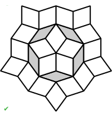

# Penrose Tilings: Physical tiling #

## Contents ##

Documentation pages:&nbsp; 
&bull;&nbsp;[Introduction](introduction.md);&nbsp; 
&bull;&nbsp;[Paths](paths.md);&nbsp; 
&bull;&nbsp;[C&nbsp;code](c.md);&nbsp; 
&bull;&nbsp;[JSON&nbsp;output](json.md);&nbsp; 
&bull;&nbsp;[TSV&nbsp;output&nbsp;and&nbsp;a&nbsp;spreadsheet](tsv.md);&nbsp; 
&bull;&nbsp;[SVG&nbsp;output](svg.md);&nbsp; 
&bull;&nbsp;[PostScript&nbsp;output&nbsp;(distillable)](postscript_distillable.md);&nbsp; 
&bull;&nbsp;[PostScript&nbsp;output&nbsp;(data)](postscript_data.md);&nbsp; 
&bull;&nbsp;**Physical&nbsp;tiling**.

For most users of this repo, its purpuse is to finish with a physical tiling. 

## My kitchen ##

Its thins, as in [this picture](../images/20230923_kitchen_tiles.png), are mid&#8209;grey; but all its fats are near&#8209;white. 
The tiles were made by [Concrete&#8239;Etc](https://www.concreteetc.co.uk/), +44&nbsp;20&nbsp;7859&nbsp;4730, of Croydon&nbsp;CR0&nbsp;9UG.

For a room about 55m&sup2; (&asymp;&nbsp;600ft&sup2;), a tile edge length of 150mm (&asymp;&nbsp;5.9&Prime;) worked well, as did the dark-and-light-grey choice of &lsquo;colours&rsquo;.

My guess is that, for coloured paths, such a room is too small. 
My guess is, for coloured paths to work aesthetically, there would have to be &ge;&#8239;2 instances of paths of length 105, and hence more of the 55s etc. 
But, for emphasis, this is only a guess: make a map, judge for yourself.

And I want to see a Penrose tiling with coloured paths: please send pictures of the result, or, better, invite me to visit. 

## Advice ##

### Digital ###

If your room size is, in tiles, not much larger than mine, then duplicate one of the files which has a map of my kitchen ([SVG](../images/Penrose_Rh_08_kitchen_zoom.svg), [PostScript](../postscript_pdf/Kitchen_Rh_08.ps)). 
(If your room is much larger, then pick an equivalent output from a larger `tilingId`, and transfer over the relevant pieces.) 
Measure your room carefully. 
In the file, make the outline of the room match your measurements. 
Choose where the room is to go: that is, choose what part of the pattern is to be in the room. 
Unless an expert programmer, it is likely easier to rotate the room (*x*&#8239;&#11104;&#8239;*y*, *y*&#8239;&#11104;&#8239;&minus;*x*) than to rotate the tiling. 

Cool off for a day; review; tinker; re&#8209;review; re&#8209;tinker; repeat; re&#8209;repeat.

### Counting ###

How many tiles are needed?

* \# Fats&nbsp;&asymp;&nbsp;0.76&#8239;&times;&#8239;Area&#8239;/&#8239;EdgeLength&sup2;&nbsp;&times;&nbsp;1.1;

* \# Thins&nbsp;&asymp;&nbsp;0.47&#8239;&times;&#8239;Area&#8239;/&#8239;EdgeLength&sup2;&nbsp;&times;&nbsp;1.1.

The &ldquo;&times;&nbsp;1.1&rdquo;, the safety-margin extra +10%, is for cutting of edge tiles, etc. 
Check the areas ands counts yourself&mdash;it&rsquo;s your risk, not my liability. 
(In the formulae the two constants are rounded versions of &frac15;&radic;(10&nbsp;&plusmn;&nbsp;2&radic;5).)

If paths are to be coloured, then the tile counting is more complicated: there must be counting of paths and partial counting of boundary-overlapping paths. 
This cannot be done by a simple rule describing limiting behaviour, because in the limit most tiles are in very long paths.

When ready, order tiles from the manufacturer, which might be [Concrete&#8239;Etc](https://www.concreteetc.co.uk/).

### Laying tiles ###

The tiler(s) will need a few printed copies of the map, and a felt&#8209;tip pen with which to dot on the map each tile as it is laid. 
Start in a corner; grow from there. 
If there is a particular corner that is the most visible, the most important corner for many tiles to precisely touch the edge of the room, then start in that corner.

Active supervision is essential. 
If this is the tiler&rsquo;s first Penrose tiling, as is likely, then mistakes will be made. 
Tilers get a &lsquo;feel&rsquo; for how things are going, then ignore the map, and soon after it will go wrong. 
With probability&nbsp;1 there will an error. 
Pull up the erroneous tiles; go back a few steps. 
I have been there.
 
So, when work starts, check every thirty minutes or so &mdash; where &ldquo;check&rdquo; means check every tile against the map, most easily done by following paths. 
I did; it was necessary; without the active supervision it would have gone very wrong; you have been warned.

One particular type of error can be tricky to find. 
Observe the round&#8209;5 path and touching thins, which together form a regular decagon. 
Therefore they could be rotated &plusmn;36&deg;, and would still exactly fit in the same hole. 
But it would be wrong. 
In a correct Penrose tiling, never do two parallel fats touch. 
That is, the following is forbidden. 

In the following the left diagram has five visible errors, so is a particularly obvious instance of the problem.

 &nbsp; &nbsp; 

If two fats are parallel and touching, whether touching at an edge or a vertex, then this is an error, perhaps caused by mis&#8209;rotation of a round&nbsp;5 path.

### Laying many tiles ###

If your Penrose tiling is to be huge (hurray!), then consider having a machine lay the tiles. 
Humans might just be too unsystematic for this task. 
Of course, before starting on the huge space, have the machine&mdash;or if necessary the humans&mdash;practise on a space that is still quite large, but materially smaller. 

Such a machine should be fed the [JSON&nbsp;output](json.md), or something derived from it, as JSON is the most machine-comprehensible of the output formats.

Good luck.
