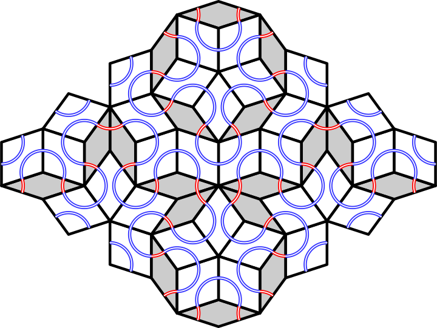
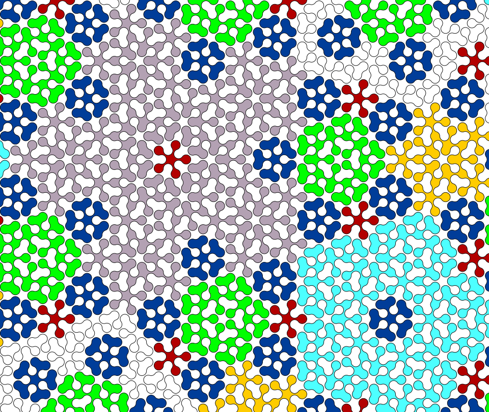
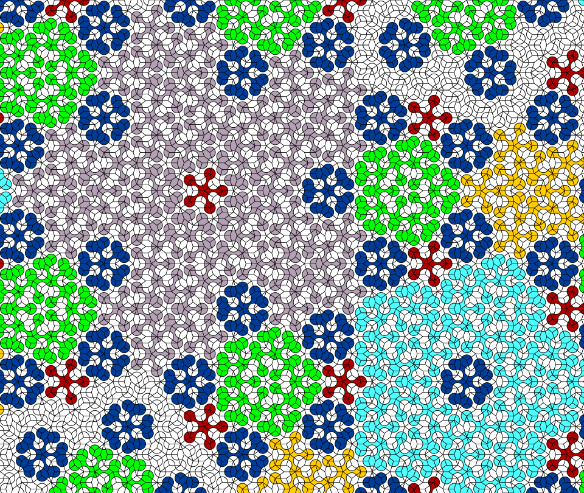
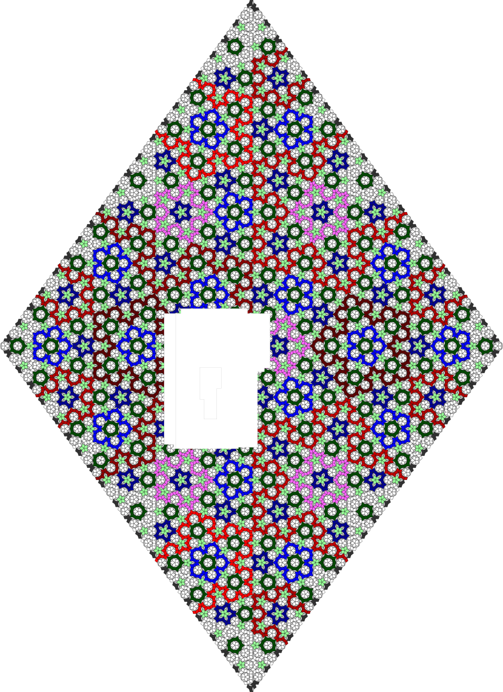
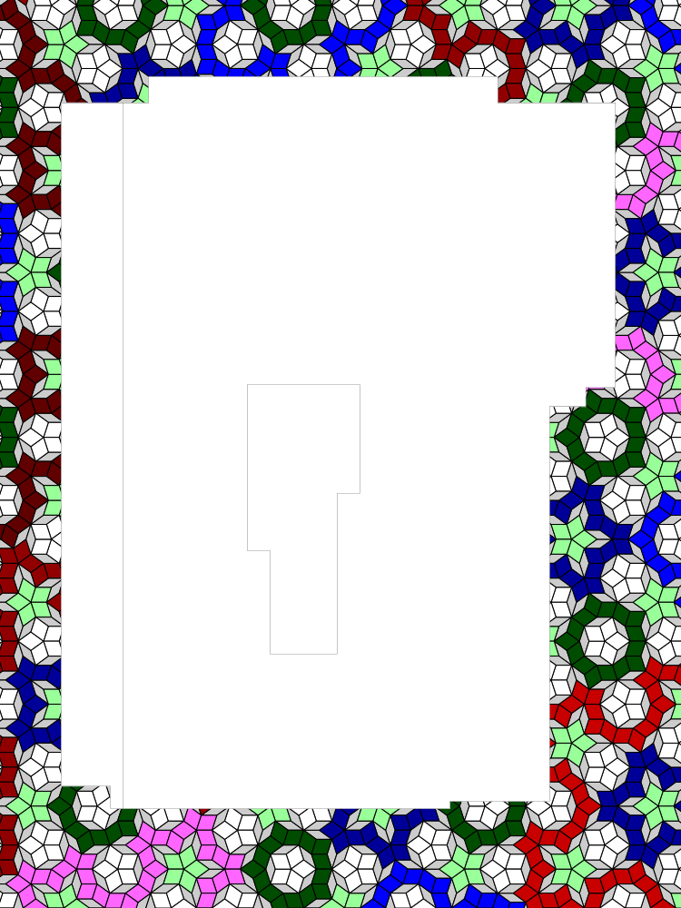

# Penrose Tilings: SVG output #

## Contents ##

Documentation pages:&nbsp; 
&bull;&nbsp;[Introduction](introduction.md);&nbsp; 
&bull;&nbsp;[Paths](paths.md);&nbsp; 
&bull;&nbsp;[C&nbsp;code](c.md);&nbsp; 
&bull;&nbsp;[JSON&nbsp;output](json.md);&nbsp; 
&bull;&nbsp;[TSV&nbsp;output&nbsp;and&nbsp;a&nbsp;spreadsheet](tsv.md);&nbsp; 
&bull;&nbsp;**SVG&nbsp;output**;&nbsp; 
&bull;&nbsp;[PostScript&nbsp;output&nbsp;(distillable)](postscript_distillable.md);&nbsp; 
&bull;&nbsp;[PostScript&nbsp;output&nbsp;(data)](postscript_data.md);&nbsp; 
&bull;&nbsp;[Physical&nbsp;tiling](physical_tiling.md).


## Some output ##

<table>
<tr>
	<th align="right">Rhombii:</th>
	<td><a href="../images/Penrose_Rh_00.svg">00</a></td>
	<td><a href="../images/Penrose_Rh_01.svg">01</a></td>
	<td><a href="../images/Penrose_Rh_02.svg">02</a></td>
	<td><a href="../images/Penrose_Rh_03.svg">03</a></td>
	<td><a href="../images/Penrose_Rh_04.svg">04</a></td>
	<td><a href="../images/Penrose_Rh_05.svg">05</a></td>
	<td><a href="../images/Penrose_Rh_06.svg">06</a></td>
	<td><a href="../images/Penrose_Rh_07.svg">07</a></td>
	<td><a href="../images/Penrose_Rh_08.svg">08</a></td>
	<td><a href="../images/Penrose_Rh_09.svg">09</a></td>
	<td><a href="../images/Penrose_Rh_10.svg">10</a></td>
	<td><a href="../images/Penrose_Rh_11.svg">11</a></td>
</tr><tr>
	<th align="right">Arcs:</th>
	<td><a href="../images/Penrose_Arcs_00.svg">00</a></td>
	<td><a href="../images/Penrose_Arcs_01.svg">01</a></td>
	<td><a href="../images/Penrose_Arcs_02.svg">02</a></td>
	<td><a href="../images/Penrose_Arcs_03.svg">03</a></td>
	<td><a href="../images/Penrose_Arcs_04.svg">04</a></td>
	<td><a href="../images/Penrose_Arcs_05.svg">05</a></td>
	<td><a href="../images/Penrose_Arcs_06.svg">06</a></td>
	<td><a href="../images/Penrose_Arcs_07.svg">07</a></td>
	<td><a href="../images/Penrose_Arcs_08.svg">08</a></td>
	<td><a href="../images/Penrose_Arcs_09.svg">09</a></td>
	<td><a href="../images/Penrose_Arcs_10.svg">10</a></td>
	<td><a href="../images/Penrose_Arcs_11.svg">11</a></td>
</tr>
</table>

Also [kitchen unzoomed](../images/Penrose_Rh_08_kitchen.svg); [kitchen zoomed](../images/Penrose_Rh_08_kitchen_zoom.svg).

## Arcs ##


Start with a &lsquo;standard&rsquo; Penrose tiling, of rhombii, 72&deg; and 36&deg;. 
Inside each rhombus, centred on the east and west corners (108&deg; and 36&deg;), draw an arc. 

<div align="center">



</div>

This has been done in the preceding diagram, for clarity the arcs in the fats being blue, in the thins being red. 
And, if done at scale, with rhombii being hidden, this makes elegant swirly patterns.
Behold the next image.

<div align="center">



</div>

Closed paths of arcs have been filled. 
The outermost closed paths of arcs have been filled with a colour, varying by length. 
The paths immediately in from those have been filled white. 
The paths immediately in from those have been filled with a non-white colour. 
And so on. 

So there is a odd-even nature to the filling. 

In rhombii space open paths could be coloured, because, in effect, the rhombii colouration is a stroke-like painting. 
But in these arc paths the colouration is a fill-like painting&nbsp;&DoubleLongRightArrow; open arc paths cannot be coloured. 

Compare to the same pattern in rhombii space. 

<div align="center">


</div>

Overlapped for easier comparison:


<div align="center">



</div>


## C Code ##

The code for SVG output has some controls in <kbd>controls.c</kbd>. 

For both rhombii and arcs, `svg_toPaint_xMin()`, `svg_toPaint_yMin()`, `svg_toPaint_xMax()`, `svg_toPaint_yMax()` return the wanted bounding box, elements wholly outside not being output. By default these are &plusmn;999999, but for the above images pictures and others in the documentation, were `-0.09830056`, `+0.46449333`, `+1.27553483`, `+1.62459848` respectively.


## SVG code ##

Arcs painted for the longest paths first, then shorter. 
For each path, repeatedly traverse the field `.pathId_ShortestOuter` until either there it is `-1` (so path is outside) or the next outside path is longer than the value returned by `svg_arcs_longestPathToBeColoured()` (which is in <kbd>controls.c</kbd>). 
If there are an **e**ven number of steps to this &lsquo;outside&rsquo;, colour with a style ending `_e`; if **o**dd, `_o`. By default the `_e` are generally real colours; all the `_o` are white.

* All these `<style>`&hellip;`</style>` are specified in the SVG, so amenable to alteration by a user without needing to re-run the C. 

* For the rhombii, the SVG specifies paths with names 
`#t`&nbsp;=&nbsp;thin rhombus, 
`#f`&nbsp;=&nbsp;fat rhombus in a closed path, and 
`#o`&nbsp;=&nbsp;fat rhombus in an open path. 
These are all changeable, and comments include one suggested change.

* For the rhombii, the object with `id='c5r'`, being round-5 paths, includes the white circle at its centre. If not wanted, delete or comment away (<code>\<!-- &hellip; --\></code>).

* At the end of each SVG file there is code, commented out, that makes gridlines. 
If wanted, uncomment.

* For both arcs and rhombii, users might want to change the opening instruction. In the original of an SVG it is a single line, but here spread out for clarity.

```SVG
<svg
	width='960'   height='1321.998631951'
	viewBox='-6.451357882 -8.032964799 11.666647787 16.065929598'
	preserveAspectRatio='xMidYMid meet'
	id='Penrose_Rhombii_11'
	xmlns='http://www.w3.org/2000/svg'
>
```

The width and height are measured in screen pixels. 
The `viewBox`, *left* *bottom* *width* *height*, is measured in the units in which rhombii etc are specified. 
Because `preserveAspectRatio` is neither `'none'` nor `'slice'`, the two aspect ratios don&rsquo;t need to be the same. 
Nonetheless, they have been set equal (to within &plusmn;10&#8315;&#8313;): both 1321.998631951&nbsp;&divide;&nbsp;960 and 16.065929598&nbsp;&divide;&nbsp;11.666647787 are &asymp;&nbsp;1.377081908. 

If zooming in, it might be better to do so using the C (by changing `svg_toPaint_xMin()` etc), as that would prevent the file having artefacts not shown: smaller file size is faster download is SEO happiness.


## Kitchen ##

Finally, the next two SVGs show the plan for [my kitchen](../images/20230923_kitchen_tiles.png). 

The first SVG includes, near the end of the file, the kitchen specification, room units being millimeters. 

<div align="center">



</div>

The next file is the same as the previous, except the first line, which has been altered to zoom (with consistent aspect ratio of 1&frac13;).

<div align="center">



</div>

Both these files are amenable to alteration by a user. 
Indeed, for those tiling a non-huge space, these SVGs or their PostScript equivalent, appropriately amended, might be all that is needed from this repo.
