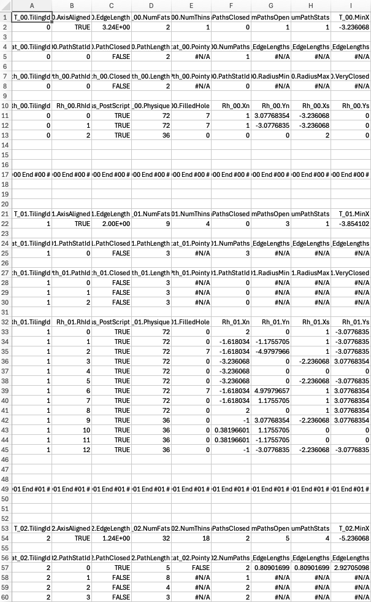
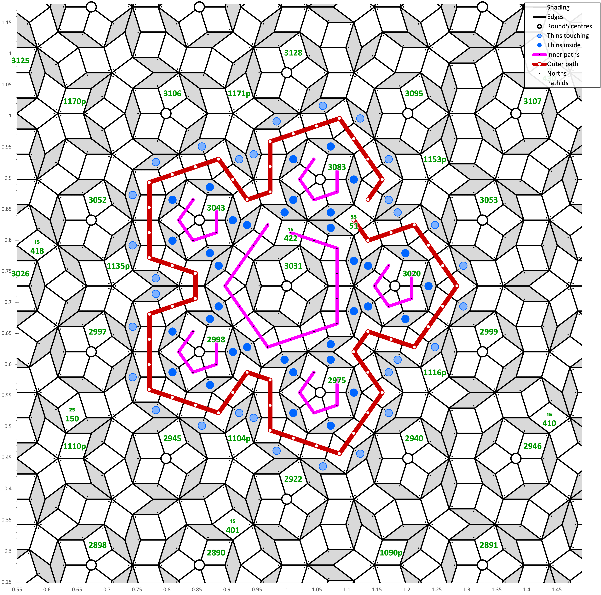

# Penrose Tilings: TSV output and a spreadsheet #

## Contents ##

Documentation pages:&nbsp; 
&bull;&nbsp;[Introduction](introduction.md);&nbsp; 
&bull;&nbsp;[Paths](paths.md);&nbsp; 
&bull;&nbsp;[C&nbsp;code](c.md);&nbsp; 
&bull;&nbsp;[JSON&nbsp;output](json.md);&nbsp; 
&bull;&nbsp;**TSV&nbsp;output&nbsp;and&nbsp;a&nbsp;spreadsheet**;&nbsp; 
&bull;&nbsp;[SVG&nbsp;output](svg.md);&nbsp; 
&bull;&nbsp;[PostScript&nbsp;output&nbsp;(distillable)](postscript_distillable.md);&nbsp; 
&bull;&nbsp;[PostScript&nbsp;output&nbsp;(data)](postscript_data.md);&nbsp; 
&bull;&nbsp;[Physical&nbsp;tiling](physical_tiling.md).

## Files ##

Files:&nbsp;&nbsp; 
[Penrose.xlsx](../data/Penrose.xlsx);&nbsp;&nbsp; 
[modChartSize.vba](../vba/modChartSize.vba),&nbsp;&nbsp; 
[modChartAxis.vba](../vba/modChartAxis.vba),&nbsp;&nbsp; 
[modRangeNames.vba](../vba/modRangeNames.vba);&nbsp;&nbsp; 
[Penrose_10.tsv.zip](../data/Penrose_10.tsv.zip).

## TSV ##

TSV, tab-separated values, is a very convenient format for text data for input into a spreadsheet. 
It is slightly more spreadsheet-idiomatic than comma-separated, as copy-pasting text TSV into a spreadsheet just works. 
And the structure of this TSV output is optimised for use in a spreadsheet.

Behold!

There are blocks of data, each block beginning with a row intended to become range names. 
To assist with range name management there is VBA, discussed below. 

But the overall structure of the data, and the meaning of its fields, resembles that in the [JSON&nbsp;output](json.md), to which readers are referred. 

* The intended range names all have the form *TableName*.*FieldName*.

* The table names begin:
    - `T_`, being single values applicable to the whole tiling,
    - `PthStat_` being arrays of PathStats,
    - `Pth_`, being arrays of paths,
    - `Rh_`, being arrays of rhombi.

* There is then a two-digit tiling number. I.e., range names begin with&mdash;the table names are&mdash;strings of the form `T_00.`, `PthStat_00.`, `Pth_00.`, `Rh_00.`, `T_01.`, `PthStat_01.`, `Pth_01.`, `Rh_01.`, `T_02.`, `PthStat_02.`, `Pth_02.`, `Rh_02.`, etc.

* After the dot is a field name. 

    - At the tiling level, fields are: `TilingId`, `AxisAligned`, `EdgeLength`, `NumFats`, `NumThins`, `NumPathsClosed`, `NumPathsOpen`, `NumPathStats`, `MinX`, `MaxX`, `MinY`, `MaxY`, `WantedPostScriptCentreX`, `WantedPostScriptCentreY`, `WantedPostScriptAspect`, `WantedPostScriptHalfWidth`, `WantedPostScriptHalfHeight`, `WantedPostScriptNumberRhombi`, `WantedPostScriptNumberPaths`, `Licence`, `URL`, `Author`.

    - For the PathStats, fields are: `TilingId`, `PathStatId`, `PathClosed`, `PathLength`, `Pointy`, `NumPaths`, `RadiusMinMin_EdgeLengths`, `RadiusMaxMax_EdgeLengths`, `WidthMax_EdgeLengths`, `HeightMax_EdgeLengths`, `MaxNumThisFats`, `MaxNumThisThins`, `MaxNumDeepFats`, `MaxNumDeepThins`, `MaxNumThisFats_Num`, `MaxNumThisThins_Num`, `MaxNumDeepFats_Num`, `MaxNumDeepThins_Num`, `InteriorsConsistent`.

    - The `InteriorsConsistent` is a vestigial check, likely not needed by the user. If insideness is computed consistently, then, for any length of closed path, the number of paths with the maximum number of fats within will equal the number of paths. So, for closed paths, `InteriorsConsistent` is true if all of {`NumPaths`, `MaxNumThisFats_Num`, `MaxNumThisThins_Num`, `MaxNumDeepFats_Num`, `MaxNumDeepThins_Num`} are equal.

    - For the paths, fields are: `TilingId`, `PathId`, `Closed`, `Length`, `Pointy`, `PathStatId`, `RadiusMin`, `RadiusMax`, `VeryClosed`, `PathId_ShortestOuter`, `InsideThis_NumFats`, `InsideThis_NumThins`, `InsideDeep_NumFats`, `InsideDeep_NumThins`, `CentreX`, `CentreY`, `MinX`, `MaxX`, `MinY`, `MaxY`, `Orient`, `WantedPS`, `RhOpenPathEnd`, `RhPathStart`, `RhPathCentreFurthest`, `RhThinWithin_First`, `RhThinWithin_Last`.

    - For the rhombi, fields are: `TilingId`, `RhId`, `Wantedness_PostScript`, `Physique`, `FilledHole`, `Xn`, `Yn`, `Xs`, `Ys`, `Xe`, `Ye`, `Xw`, `Yw`, `AngleDeg`, `NumNeighbours`, `NeighbourEdge_0`, `NeighbourEdge_1`, `NeighbourEdge_2`, `NeighbourEdge_3`, `NeighbourNum_0`, `NeighbourNum_1`, `NeighbourNum_2`, `NeighbourNum_3`, `NNN_0`, `NNN_1`, `NNN_2`, `NNN_3`, `PathId`, `WithinPathNum`, `EdgeClosestToPathCentre`, `PathId_ShortestOuter`. The neighbours information, which in the [JSON&nbsp;output](json.md) are shaped as an array of at most 4 dictionaries, in the TSV have been unrolled into fields ending `_0`, `_1`, `_2`, and `_3`.

* All fields have broadly the same meaning as in the [JSON&nbsp;output](json.md), except that values absent in the [JSON&nbsp;output](json.md) have in the TSV become the Excel-idiomatic `#N/A`.

## Spreadsheet ##

There is an example spreadsheet containing intricate chart-plotting formulae. 
For most Excel-esque tasks likely to be attempted with this data, this spreadsheet is strongly recommended as a starting point. 

However, it is very unsecure to download from the internet macro-enabled documents, and hence many corporate firewalls, sensibly, block them. 
But this this spreadsheet needs a small amount of macro-support: 
* For standard range name handling (all of which should be built into Excel, tut tut): `RangeNames_DeleteRef()`, which is one of a set of my standard VBA routines so also included are my standard `RangeNames_DeleteBeginningWith()`, `RangeNames_DeleteContaining()`, and `RangeNames_DeDuplicate()`.
* To make range names given the particular structure of the <kbd>.tsv</kbd> output: `RangeNamesPenrose_Create()`.
* To set the scale of an Excel chart axis (partly because the built-in automatic scaling is just awful, tut tut): `Axis_Scale()`.
* To return the size of a chart&rsquo;s plot area, so that scaling can be chosen to make actually equal _x_ and _y_ distances seem optically equal.

So read carefully &mdash; actually read, actually carefully, as if you don&rsquo;t trust software downloaded from the internet &mdash; all of [modChartSize.vba](../vba/modChartSize.vba), [modChartAxis.vba](../vba/modChartAxis.vba), and [modRangeNames.vba](../vba/modRangeNames.vba), and add them as modules in the example spreadsheet.

In the spreadsheet are instructions for replacing the TSV, which for simplicity of version control are not repeated here.

There follows a PNG of a chart made by the spreadsheet.

Of course, the user can play and alter and delete, and copy parts with variations. 
That is the purpose of a spreadsheet. 

The chart has nine series. 

1. The shading of the thins, as lines no markers. (In Excel shading in an abomination; this shading is therefore an abomination; the spill formula by which the plottable series are made therefore must be an abomination, and indeed is an abomination. Microsoft:&nbsp;[tut&nbsp;tut](https://feedbackportal.microsoft.com/feedback/idea/2cc833e2-d1fe-ef11-a4dd-7c1e52ead3c1).)

2. Edges of all the rhombi, as lines no markers.

3. The round centres of the closed non-pointy 5-paths, shown as markers no lines.

4. There is an identified path, chosen in range name `Chart.PathId_Important`, in the pictured example having PathId &Equal; `51`. This series is the centres of the thins that are touching that path but outside it, shown as markers no lines.

5. Centres of the thins that are immediately inside the path (so not inside a path inside the path), shown as markers no lines.

6. Paths immediately inside the chosen path.

7. The chosen path itself.

8. Small dot markers in the north corner of all rhombi.

9. Path labels, showing length (except for 5s) and Id, as no markers no lines only labels.
